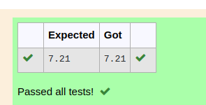

# DISTANCE-BETWEEN-TWO-POINTS

## AIM:
To write a python program to find the distance two 2 points
## ALGORITHM:
### Step 1: 
### Step 2:
### Step 3: 
Substitute the values in the distance formula  
### Step 4: 
### Step 5: 
### PROGRAM:
``` python
#Program to find the distance between two points.
#Developed by:Nithyaa sri S S 
#RegisterNumber:22008434
import math 
l1=[10,6]
l2=[4,2]
d=math.sqrt(math.pow(l2[0]-l1[0],2)+math.pow(l2[1]-l1[1],2))
print("{:.2f}".format(d))
 
 ```
  ### OUTPUT:

### RESULT:
